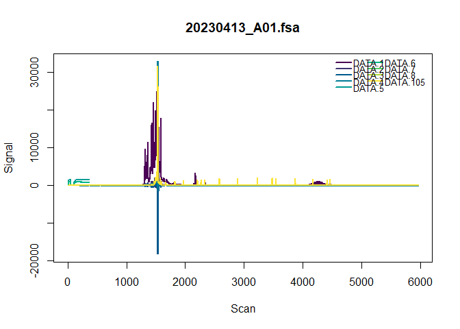
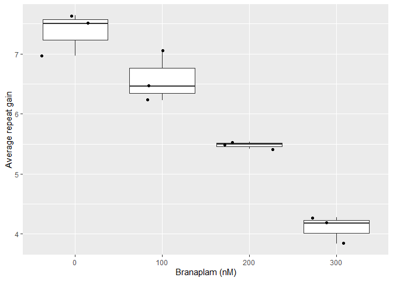

# Tandem Repeat Analysis from Capillary Electrophoresis (trace)

<!-- badges: start -->

[](https://github.com/zachariahmclean/trace/actions/workflows/R-CMD-check.yaml)

<!-- badges: end -->

This package provides a pipeline for short tandem repeat instability
analysis from capillary electrophoresis fragment analysis data (e.g fsa
files). The main function processes the data and then and then repeat
instability metrics are calculated (i.e. expansion index or average
repeat gain).

This code is not for clinical use. There are features for accurate
repeat sizing if you use validated control samples, but integer repeat
units are not returned.

To report bugs or feature requests, please visit the Github issue
tracker [here](https://github.com/zachariahmclean/trace/issues). For
assistance or any other inquires, contact [Zach
McLean](mailto:zmclean@mgh.harvard.edu?subject=%5BGitHub%5D%20trace).

If you use this package, please cite
[this](https://www.nature.com/articles/s41467-024-47485-0) paper for
now.

# How to use the package

Either you can use the code described below, or our [Shiny
app](https://traceshiny.mgh.harvard.edu/) to use an interactive
non-coding version.

In this package, each sample is represented by an R6 ‘fragments’ object,
which are organized in lists. You usually don’t need to interact with
the objects directly. If you do, the attributes of the objects can be
accessed with \$.

There are several important factors to a successful repeat instability
experiment and things to consider when using this package:

- (required) Each sample has a unique id, usually the file name

- (optional) Baseline control for your experiment. For example,
  specifying a sample where the modal allele is the inherited repeat
  length (eg a mouse tail sample) or a sample at the start of a
  time-course experiment. This is indicated with a `TRUE` in the
  `metrics_baseline_control` column of the metadata. Samples are then
  grouped together with the `metrics_group_id` column of the metadata.
  Multiple samples can be `metrics_baseline_control`, which can be
  helpful for the average repeat gain metric to have a more accurate
  representation of the average repeat at the start of the experiment.

- (optional) Batch or repeat length correction for systematic batch
  effects that occur with repeat-containing amplicons in capillary
  electrophoresis.

  - Repeat containing amplicons do not run linearly with internal ladder
    sizes in capillary electrophoresis resulting is an underestimation
    of repeat length if you just convert from base-pair size. These
    differences are not always consistent across runs which can result
    in batch effects in the repeat size. So, if the repeat length is to
    be directly compared for samples from different runs, this batch
    effect needs to be corrected. This is only relevant when the
    absolute size of a amplicons are compared for grouping metrics as
    described above (otherwise instability metrics are all relative and
    it doesn’t matter that there’s systematic batch effects across
    runs), when plotting traces from different runs, or if an accurate
    repeat length is desired.

  - There are two main correction approaches that are somewhat related:
    either ‘batch’ or ‘repeat’ in `call_repeats()`. Batch correction is
    relatively simple and just requires you to link samples across
    batches by indicating them from metadata. But even though the repeat
    size that is return will be precise, it will not be accurate and
    underestimates the real repeat length. By contrast, repeat
    correction can be used to accurately call repeat lengths (which also
    corrects the batch effects). However, the repeat correction will
    only be as good as your sample(s) used to call the repeat length, so
    this can a challenging and advanced feature. You need to use a
    sample that reliably returns the same peak as the modal peak, or you
    need to be willing to understand the shape of the distribution and
    manually validate the repeat length of each control sample for each
    run.

- If starting from fsa files, the GeneScan™ 1200 LIZ™ dye Size Standard
  ladder assignment may not work very well due to how the ladder
  assignment algorithm works. It is optimized for scenarios where all
  peaks of the ladder are resolved, which is usually the case for
  GeneScan™ 500 LIZ™ or GeneScan™ 600 LIZ™. To work in this package,
  Ladders like 1200 LIZ™ need to be run on the instrument in such a way
  that all of the peaks are resolved, otherwise they all blend together
  at the end. However, these ladders can be fixed by playing with the
  various parameters (or supplying a truncated version of the GeneScan™
  1200 LIZ™) or manually with the built-in fix_ladders_interactive()
  app.

# Installation

Install the package from CRAN:

``` r
install.packages("trace")
```

# Import data

Load the package:

``` r
library(trace)
```

First, we read in the raw data. In this case we will used example data
within this package, but usually this would be fsa files that are read
in using `read_fsa()`. The example data is also cloned since the next
step modifies the object in place.

``` r
fsa_list <- lapply(cell_line_fsa_list, function(x) x$clone())
```

Alternatively, this is where you would use data exported from Genemapper
if you would rather use the Genemapper bp sizing and peak identification
algorithms.

``` r
fragments_list_genemapper <- genemapper_table_to_fragments(example_data,
  dye_channel = "B",
  min_size_bp = 300
)
```

# Process Samples with `trace`

The `trace()` function streamlines the processing of fragment analysis
data, from ladder assignment to repeat calling. Below is an overview of
the key steps that are within `trace()`:

## 1. **Add Metadata**

Metadata is used to enable advanced functionality, such as batch
correction, repeat correction, and index peak assignment. Prepare a
`.csv` file with the following columns:

| Column Name | Purpose | Description |
|----|----|----|
| `unique_id` | Required to link up the metadata file with samples | Unique identifier for each sample (e.g., file name). Must be unique across all runs. |
| `metrics_group_id` | Group samples for instability metrics (e.g., expansion index) | Group ID for samples sharing a common baseline (e.g., mouse ID or experiment group). |
| `metrics_baseline_control` | Identify baseline samples (e.g., inherited repeat length or day 0) | Set to `TRUE` for baseline control samples (e.g., mouse tail or starting time point). |
| `batch_run_id` | Group samples by run for batch or repeat correction | Identifier for each fragment analysis run (e.g., date). |
| `batch_sample_id` | Link samples across runs for batch or repeat correction | Unique ID for each sample across runs. |
| `batch_sample_modal_repeat` | Specify validated repeat lengths for repeat correction | Validated modal repeat length for samples used in repeat correction. |

## 2. **Assign Ladders**

Ladder peaks are identified in the ladder channel, and base pair (bp)
sizes are predicted for each scan.

- **Visual Inspection**: Always inspect ladders to ensure correct
  assignment.
- **Manual Adjustment**: If needed, use `fix_ladders_interactive()` to
  adjust ladder assignments interactively.


## 3. **Find Fragments**

Fragment peaks are identified in the raw trace data. This step
transitions the data from a continuous trace to a peak-based
representation.

## 4. **Identify Alleles**

- Identify the main allele (modal peak) for each sample. Can handle
  samples with two alleles, but metrics are only calculated for the
  larger of the two.

## **5. Call Repeats**

- Base pair sizes are converted to repeat lengths. This step has a lot
  of additional functionality including:
  - Batch correction or accurate repeat sizing.
  - Forcing whole repeat units between peaks (usually underestimated in
    fragment analysis data)

## 5. **Assign Index Peaks**

The index peak is the reference repeat length used for instability
metrics like expansion index.

- **Grouped Assignment**: Set `grouped = TRUE` to use the modal peak of
  baseline control samples (e.g., mouse tail or day 0).
- **Manual Override**: Use `index_override_dataframe` to manually assign
  index peaks if needed.

## Main function

To carry out this pipeline, call the main function:

``` r

fragments_list <- trace(
  fsa_list, 
  min_bp_size = 300,
  grouped = TRUE, 
  metadata_data.frame = metadata,
  show_progress_bar = FALSE)
```

We can validate that the index peaks were assigned correctly with a
dotted vertical line added to the trace. This is perhaps more useful in
the context of mice where you can visually see when the inherited repeat
length should be in the bimodal distribution.

``` r
plot_traces(fragments_list[1], xlim = c(110, 150))
```



# Calculate instability metrics

All of the information we need to calculate the repeat instability
metrics has been identified. We can use
`calculate_instability_metrics()` to generate a dataframe of per-sample
metrics.

``` r
metrics_grouped_df <- calculate_instability_metrics(
  fragments_list = fragments_list,
  peak_threshold = 0.05,
  window_around_index_peak = c(-40, 40)
)
```

These metrics can then be used to quantify repeat instability. For
example, this reproduces a subset of Figure 7e of [our
manuscript](https://www.nature.com/articles/s41467-024-47485-0).

``` r
library(ggplot2)
library(dplyr)

metrics_grouped_df |>
  left_join(metadata, by = join_by(unique_id)) |>
  filter(
    day > 0,
    modal_peak_signal > 500
  ) |>
  ggplot(aes(as.factor(treatment), average_repeat_change)) +
    geom_boxplot() +
    geom_jitter() +
    labs(y = "Average repeat gain",
         x = "Branaplam (nM)") 
```


