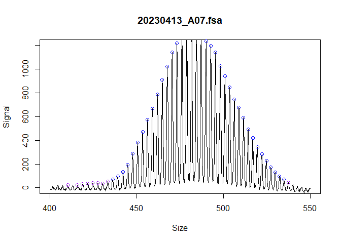
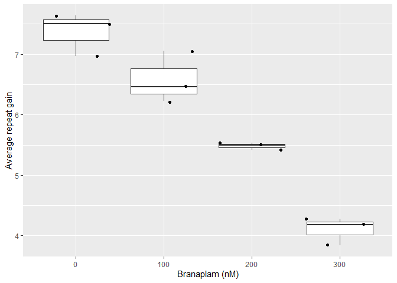

# Tandem Repeat Analysis from Capillary Electrophoresis (trace)

<!-- badges: start -->

[](https://github.com/zachariahmclean/trace/actions/workflows/R-CMD-check.yaml)
<!-- badges: end -->

This package provides a pipeline for short tandem repeat instability
analysis from fragment analysis data. The inputs are fsa files or peak
tables (eg Genemapper 5 software output), and a user supplied metadata
data-frame. The functions identify ladders, calls peaks, and calculate
repeat instability metrics (ie expansion index or average repeat gain).

This code is not intended to function as a genotyping tool in its
current form. While the repeat lengths generated are precise, they are
not accurate. The conversion from bp size to repeat length
underestimates the actual repeat length because amplicons containing
repeats do not run linearly with the internal size standard ladder.
However, for calculating instability metrics, this inaccuracy is
inconsequential since these metrics are relative measures.

To report bugs or feature requests, please visit the Github issue
tracker [here](https://github.com/zachariahmclean/trace/issues). For
assistance or any other inquires, contact [Zach
McLean](mailto:zmclean@mgh.harvard.edu?subject=%5BGitHub%5D%20trace).

If you use this package, please cite
[this](https://www.nature.com/articles/s41467-024-47485-0) paper for
now.

# How to use the package

For an easy way to get started with your own data or to run an example,
use `trace::generate_trace_template()` to generate a document with the
pipeline pre-populated.

In this package, each sample is represented by an R6 ‘fragments’ object,
which are organized in lists. Functions in the package iterate over
these lists, so you usually don’t need to interact with the objects
directly. If you do, the attributes of the objects can be accessed with
\$, and note that most functions modify the objects in place, so
re-assignment isn’t necessary. The only exception to that
`find_fragments`, which transitions to a new object since the class
structure changes.

There are several important factors to a successful repeat instability
experiment and things to consider when using this package:

- (required) Each sample has a unique id, usually the file name

- (optional) Baseline control for your experiment. For example,
  specifying a sample where the modal allele is the inherited repeat
  length (eg a mouse tail sample) or a sample at the start of a
  time-course experiment. This is indicated with a `TRUE` in the
  `metrics_baseline_control` column of the metadata. Samples are then
  grouped together with the `metrics_group_id` column of the metadata.
  Multiple samples can be `metrics_baseline_control`, which can be
  helpful for the average repeat gain metric to have a more accurate
  representation of the average repeat at the start of the experiment.

- (optional) Using common sample(s) across fragment analysis runs to
  correct systematic batch effects that occur with repeat-containing
  amplicons in capillary electrophoresis. There are slight fluctuations
  of size across runs for amplicons containing repeats that result in
  systematic differences around 1-3 base pairs. So, if samples are to be
  analyzed for different runs, the absolute bp size is not comparable
  unless this batch effect is corrected. This is only relevant when the
  absolute size of a amplicons are compared for grouping metrics as
  described above (otherwise instability metrics are all relative and it
  doesn’t matter that there’s systematic batch effects across runs) or
  when plotting traces from different runs. This correction can be
  achieved by running a couple of samples in every fragment analysis
  run, or having a single run that takes a couple of samples from every
  run together, thereby linking them. These samples are then indicated
  in the metadata with `batch_run_id` (to group samples by fragment
  analysis run) and `batch_sample_id` (to enable linking samples across
  batches).

- If starting from fsa files, the GeneScan™ 1200 LIZ™ dye Size Standard
  ladder assignment may not work very well. The ladder identification
  algorithm is optimized for GeneScan™ 500 LIZ™ or GeneScan™ 600 LIZ™ or
  other ladders with relatively few peaks. The 1200 LIZ™ ladder has a
  challenging pattern of ladder peaks to automatically assign. However,
  these ladders can be fixed by playing with the various parameters or
  manually with the built-in fix_ladders_interactive() app.

# Installation

You can install from [GitHub](https://github.com/zachariahmclean/trace)
with:

``` r
# install.packages("pak")
pak::pak("zachariahmclean/trace")
```

Then load the package:

``` r
library(trace)
```

# Import data

First, we read in the raw data. In this case we will used example data
within this package, but usually this would be fsa files that are read
in using `read_fsa()`. The example data is also cloned since the next
step modifies the object in place.

``` r
fsa_list <- lapply(cell_line_fsa_list, function(x) x$clone())
```

# Find ladders

First we find the ladders and call bp size in the fsa file. The bp is
assigned using the local Southern method. Basically, for each data
point, linear models are made for the lower and upper 3 size standard
and the predicted sizes are averaged.

``` r
find_ladders(
  fsa_list,
  show_progress_bar = FALSE
)
```

visually inspect each ladder to make sure that the ladders were
correctly assigned

``` r
plot_ladders(fsa_list[1])
```


If the ladders are are not assigned correctly, you can adjust parameters
or manually using the built-in fix_ladders_interactive() app.


# Find fragments

The fragment peaks are identified in the raw continuous trace data.
These objects are assigned because find_fragments transitions to a new
object since the class structure changes. This reflects the data moving
from a continuous trace to a peak table.

``` r
fragments_list <- find_fragments(
  fsa_list,
  min_bp_size = 300
)
```

Visually inspect the traces and called peaks to make sure they were
correctly assigned.

``` r
plot_traces(fragments_list[1],
  xlim = c(400, 550),
  ylim = c(0, 1200)
)
```



Alternatively, this is where you would use data exported from Genemapper
if you would rather use the Genemapper bp sizing and peak identification
algorithms. However, this is not recommended as some of the
functionality of this package would not be accessible (mainly in
`call_repeats()`, with `batch_correction` and repeat calling algorithms)

``` r
fragments_list_genemapper <- peak_table_to_fragments(example_data,
  data_format = "genemapper5",
  dye_channel = "B",
  min_size_bp = 300
)
```

# Add metadata

Metadata can be incorporated to allow additional functionality in
`call_repeats()` (correcting batch effects across fragment analysis
runs) and `assign_index_peaks()` (assigning index peak from another
sample). Prepare a file (eg spreadsheet saved as .csv) with the
following columns. If you use the specified column names, it will be
automatically parsed by `add_metadata()`, otherwise you will need to
match up which column name belongs to which metadata category (as done
below in `add_metadata()`):

| Metadata table column    | Functionality metadata is associated with           | Description                                                                                                                                                                                                                                                                                                     |
|--------------------------|-----------------------------------------------------|-----------------------------------------------------------------------------------------------------------------------------------------------------------------------------------------------------------------------------------------------------------------------------------------------------------------|
| unique_id                | Required for adding metadata using `add_metadata()` | The unique identifier for the fsa file. Usually the sample file name. This must be unique, including across runs.                                                                                                                                                                                               |
| metrics_group_id         | `assign_index_peaks()`, allows setting `grouped`    | This groups the samples for instability metric calculations. Provide a group id value for each sample. For example, in a mouse experiment and using the expansion index, you need to group the samples since they have the same metrics baseline control (eg inherited repeat length), so provide the mouse id. |
| metrics_baseline_control | `assign_index_peaks()`, allows setting `grouped`    | This is related to metrics_group_id. Indicate with ‘TRUE’ to specify which sample is the baseline control (eg mouse tail for inherited repeat length, or day-zero sample in cell line experiments)                                                                                                              |
| batch_run_id             | `call_repeats()`, allows setting `batch_correction` | This groups the samples by batch. Provide a value for each fragment analysis run (eg date).                                                                                                                                                                                                                     |
| batch_sample_id          | `call_repeats()`, allows setting `batch_correction` | This groups the samples across batches. Give a unique sample id to each different sample.                                                                                                                                                                                                                       |

``` r

add_metadata(
  fragments_list = fragments_list,
  metadata_data.frame = metadata,
  unique_id = "unique_id",
  metrics_group_id = "metrics_group_id",
  metrics_baseline_control = "metrics_baseline_control",
  batch_run_id = "batch_run_id",
  batch_sample_id = "batch_sample_id"
)
```

# Identify modal peaks and call repeats

Next we identify the modal peaks with `find_alleles()` and convert the
base pair fragments to repeats with `call_repeats(`).

``` r
find_alleles(fragments_list)

call_repeats(fragments_list)
```

We can view the distribution of repeat sizes and the identified modal
peak with a plotting function.

``` r
plot_traces(fragments_list[1], xlim = c(110, 150))
```


# Assign index peaks

A key part of several instability metrics is the index peak. This is the
repeat length used as the reference for relative instability metrics
calculations, like expansion index or average repeat gain. In the
metadata, samples are grouped by a `metrics_group_id` and a subset of
the samples are set as `metrics_baseline_control`, meaning they are the
samples taken at day 0 in this experiment. This allows us to set
`grouped = TRUE` and set the index peak for the expansion index and
other metrics. For mice, if just a few samples have the inherited repeat
height shorter than the expanded population, you could not worry about
this and instead use the `index_override_dataframe` in
`assign_index_peaks()`.

``` r

assign_index_peaks(
  fragments_list,
  grouped = TRUE
)
```

We can validate that the index peaks were assigned correctly with a
dotted vertical line added to the trace. This is perhaps more useful in
the context of mice where you can visually see when the inherited repeat
length should be in the bimodal distribution.

``` r
plot_traces(fragments_list[1], xlim = c(110, 150))
```


# Calculate instability metrics

All of the information we need to calculate the repeat instability
metrics has now been identified. We can finally use
`calculate_instability_metrics` to generate a dataframe of per-sample
metrics.

``` r
metrics_grouped_df <- calculate_instability_metrics(
  fragments_list = fragments_list,
  peak_threshold = 0.05
)
```

These metrics can then be used to quantify repeat instability. For
example, this reproduces Figure 7e of [our
manuscript](https://www.nature.com/articles/s41467-024-47485-0).

First, prepare the data for plotting by removing poor quality samples
and finding the average repeat gain relative to the DMSO group for each
cell line

``` r
library(dplyr)


plot_data <- metrics_grouped_df |>
  dplyr::left_join(metadata, by = dplyr::join_by(unique_id)) |>
  dplyr::filter(
    day > 0,
    modal_peak_height > 500
  ) |>
  dplyr::group_by(metrics_group_id) |>
  dplyr::mutate(
    rel_gain = average_repeat_gain / median(average_repeat_gain[which(treatment == 0)]),
    genotype = forcats::fct_rev(genotype)
  )
```

Then we can plot the instability metrics

``` r
library(ggplot2)

ggplot(
  plot_data,
  aes(genotype, rel_gain, colour = genotype)
) +
  geom_boxplot(outlier.shape = NA) +
  geom_jitter() +
  facet_wrap(vars(as.factor(treatment)), nrow = 1) +
  labs(
    y = "Average repeat gain\n(relative to DMSO)",
    x = "PMS1 pseudoexon status"
  ) +
  theme(legend.position = "none")
```


